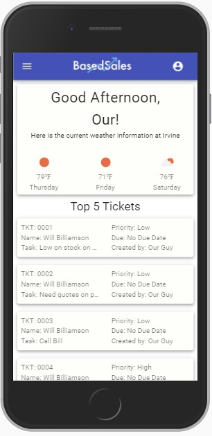

# crm-platform
A mobile responsive CRM solution for businesses who want to boost sales by concentrating on their customer base.

### Live Demo

Link: http://crm.ericmichaellowry.com

username: ourguy@lfz.com<br>
password: password




### Technologies Used
* JavaScript
* React
* Material-UI
* Node.js
* Express
* PostgreSQL
* React Router
* React Context
* React Hooks
* Node Fetch
* bcrypt
* google-libphonenumber
* Webpack
* NPM
* Google Maps Static API
* OpenWeatherMap API
* HTML5
* CSS3

## Features

### Current
* User can log in to their account
* User can open dashboard to view weather forecast and most urgent tickets
* User can view their own profile
* User can view a list of others in their organization
* User can add new user to their organization
* User can view list of assigned customers
* User can add new, edit, and delete customers
* User can view customer details
* User can view customer address on a map
* User can view a list of their assigned tickets
* User can create, edit, and delete tickets
* User can view ticket details

### Planned
* TBD

## Getting Started

### Prerequisites
* Node.js 10 or higher
* NPM 6 or higher
* PostgreSQL 10 or higher
* A Google Cloud API key
* An OpenWeaterMap API key

### API Requirements
* To run this app locally, you will need a Google Maps billing account and API key. Free trials are available and more information can be found at https://developers.google.com/maps/gmp-get-started.

* You will also need an OpenWeatherMap API key. Free trials are available at https://openweathermap.org/api.


### Database Setup
1. If PostgreSQL isn't already running, start it & sign in.
    ```shell
    $ sudo service postgresql start
    $ psql
    ```
2. While signed into PostgreSQL, create a **new database** using the following SQL command.
    ```sql
    create database "crmPlatform";
    ```
3. Still signed into PostgreSQL, create a **new user** and remember the credentials. You'll be needing them for the configuration file.
    ```sql
    create user "crmPlatform" with password 'superstrongpassword';
    ```
4. Still signed into PostgreSQL, give your new user full control over your new database with the following SQL command.
    ```sql
    grant all privileges on database "crmPlatform" to "crmPlatform";
    ```
5. Sign out of PostgreSQL with the following command. You should be returned to your bash prompt.
    ```sql
    \quit
    ```

### Environment Setup

1. Clone the repository.
    ```shell
    $ git clone https://github.com/EricL0wry/crm-platform.git
    ```
2. Once inside the project directory, install the dependencies.
    ```shell
    $ npm install
    ```
3. Copy the `.env.example` file & name it `.env`.
    ```shell
    $ cp .env.example .env
    ```
4. Edit the `.env` file to include your database credentials.
    ```
    PORT=3001
    DEV_SERVER_PORT=3000
    DATABASE_URL=postgres://<username>:<password>@localhost/crmPlatform
    SESSION_SECRET=secret
    SESSION_EXPIRY=28800000
    MAP_KEY=<YOUR_KEY_HERE>
    GOOGLE_MAP_KEY=<YOUR_KEY_HERE>
    ```
5. If the PostgreSQL isn't already running, start it up with this command.
    ```shell
    $ sudo service postgresql start
    ```
6. Import the sample database.
    ```shell
    $ npm run db:import
    ```
7. Run the dev script & visit http://localhost:3000 on your browser
    ```shell
    $ npm run dev
    ```
